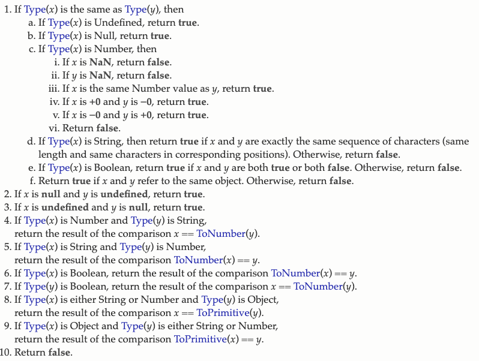

# js ==和===

## 抽象比较\(例如==\)在进行比较之前将操作数转换为相同的类型。

* 在比较数字和字符串时，将字符串转换为数字值。JavaScript尝试将字符串数字文字转换为数字类型值。首先，从字符串数字文字派生出一个数学值。接下来，将此值四舍五入为最接近的数字类型值。 
* 如果其中一个操作数是布尔操作数，则布尔操作数如果为真，则转换为1;如果为假，则转换为+0。
*  如果将对象与数字或字符串进行比较，JavaScript将尝试返回该对象的默认值。操作符试图使用对象的valueOf和toString方法将对象转换为基本值、字符串或数字值。如果转换对象的尝试失败，将生成一个运行时错误。 

## ECMAS实现抽象比较的逻辑

## 如何令a ==1 && a== 2 && a==3 返回true

[https://github.com/azl397985856/fe-interview/issues/22](https://github.com/azl397985856/fe-interview/issues/22)

